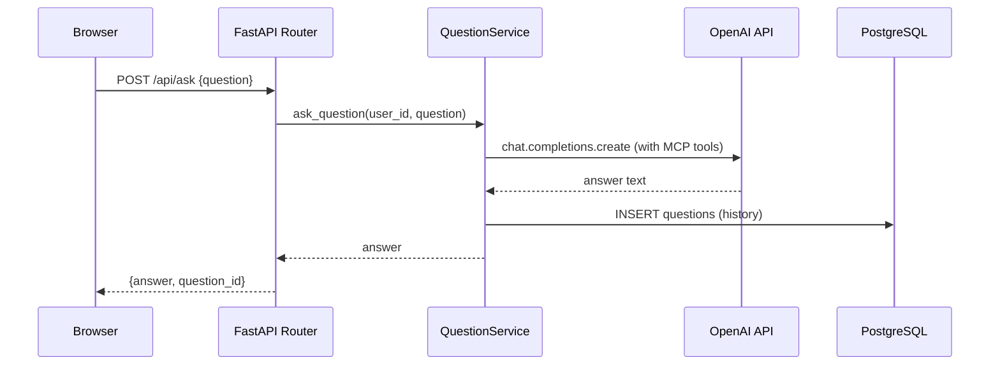
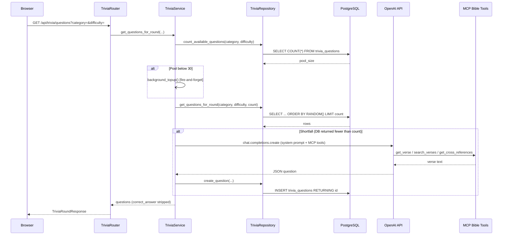
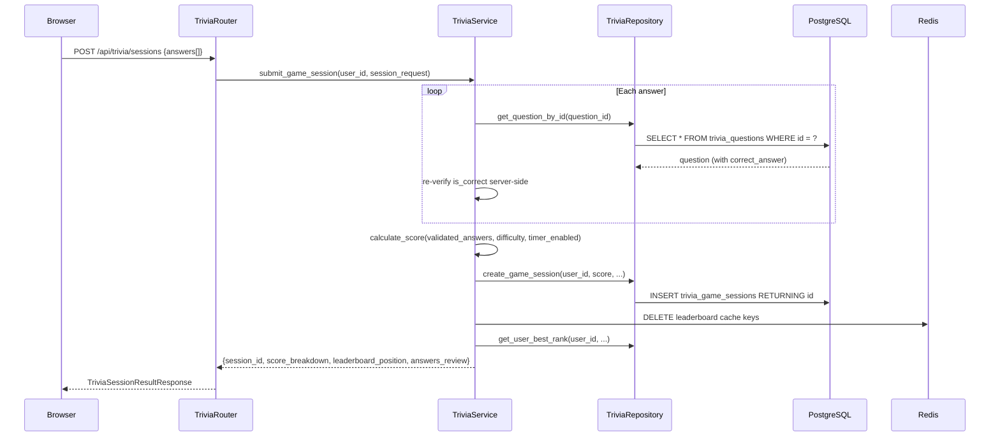
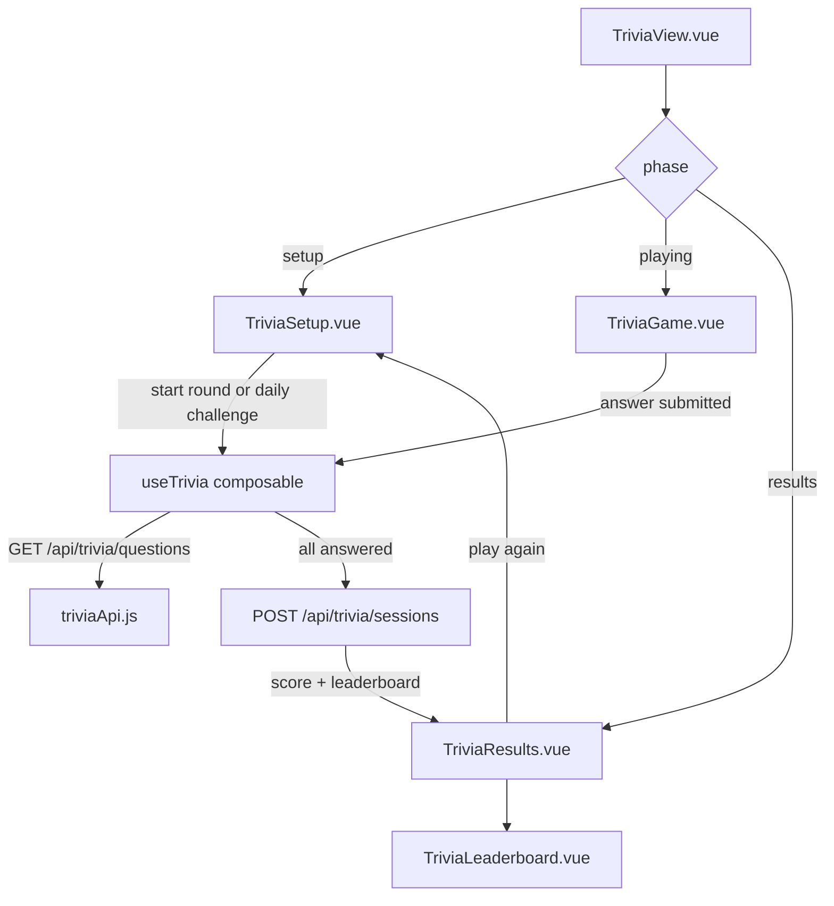

# Bible QA App — Architecture

## System Overview

```
┌─────────────────────────────────────────────────────────────────────┐
│                          Browser / Client                           │
│                    Vue 3 + Vite (port 5173)                         │
│  Views: BibleQA, Trivia, Kids, Study, Devotional, Admin, …         │
└───────────────────────────┬─────────────────────────────────────────┘
                            │ HTTP (Axios, cookie-based auth)
                            ▼
┌─────────────────────────────────────────────────────────────────────┐
│                     FastAPI Backend (port 8000)                     │
│  Routers: /api/ask  /api/trivia  /api/admin  /api/auth  …          │
│  Middleware: CSRF validation, API request logging                   │
│  Auth: JWT in HTTP-only cookies + CSRF double-submit                │
└───────┬──────────────────────────────────────┬───────────────────────┘
        │                                      │
        ▼                                      ▼
┌───────────────┐                    ┌──────────────────┐
│  PostgreSQL   │                    │      Redis       │
│  (port 5432)  │                    │   (port 6379)    │
│               │                    │                  │
│  users        │                    │  Session cache   │
│  questions    │                    │  Daily challenge │
│  verses       │                    │  Leaderboard     │
│  trivia_*     │                    │  (TTL-keyed)     │
└───────────────┘                    └──────────────────┘
        │
        ▼
┌───────────────┐
│  OpenAI API   │
│  (GPT model)  │
│               │
│  Bible Q&A    │
│  Trivia gen.  │
└───────────────┘
```

---

## Layers and Modules

### Backend (`backend/app/`)

| Layer | Path | Responsibility |
|---|---|---|
| Entry point | `main.py` | FastAPI app init, lifespan, router registration |
| Config | `config.py` | Pydantic Settings, `@lru_cache` singleton via `get_settings()` |
| Auth | `auth.py` | JWT encode/decode, CSRF token generation, guest user creation |
| Middleware | `middleware/` | CSRF enforcement, structured API request logging |
| Routers | `routers/` | HTTP route handlers — input validation and response shaping only |
| Services | `services/` | Business logic, orchestration, external API calls (OpenAI) |
| Repositories | `repositories/` | Raw SQL via psycopg2; one class per domain |
| MCP tools | `mcp/` | Model Context Protocol tool registry; exposes Bible lookup functions to OpenAI |
| Schemas | `models/schemas.py` | All Pydantic request/response models |
| Utils | `utils/` | Custom exceptions (`exceptions.py`), IP extraction (`network.py`) |
| Database | `database.py` | psycopg2 connection pool + backward-compatible re-exports of repositories |

### Frontend (`frontend/src/`)

| Layer | Path | Responsibility |
|---|---|---|
| Views | `views/` | Route-level page components (13 routes) |
| Components | `components/` | Reusable UI components; `kids/`, `trivia/`, `ui/` sub-namespaces |
| Composables | `composables/` | Shared reactive state via Vue 3 `ref`/`computed` (no Vuex/Pinia) |
| Services | `services/` | Axios API clients, one file per backend domain |
| Constants | `constants/` | Bible book names, chapter counts |
| Utils | `utils/` | Reference string parsers |
| Styles | `styles/` | CSS custom properties, base reset |

---

## Data Flow

### Bible Q&A Request



### Trivia Question Generation and Serving



### Trivia Session Submission and Scoring



---

## Feature: BibleQuest Trivia

### Database Tables

**`trivia_questions`** — AI-generated question cache

| Column | Type | Notes |
|---|---|---|
| `id` | serial PK | |
| `question_text` | text | The question |
| `question_type` | text | `multiple_choice` or `true_false` |
| `category` | text | `old_testament`, `new_testament`, `psalms_proverbs`, `doctrine_theology` |
| `difficulty` | text | `easy`, `medium`, `hard` |
| `options` | jsonb | Array of answer strings |
| `correct_answer` | text | Authoritative answer; never sent to client during a round |
| `correct_index` | int | 0-based index into `options` |
| `explanation` | text | Shown to player after answering |
| `scripture_reference` | text | e.g. `John 3:16` |
| `is_daily_challenge` | bool | True if designated as a daily question |
| `daily_date` | date | The date this question served as daily challenge |
| `times_used` | int | Incremented each time question appears in a round |
| `times_correct` | int | Incremented each time a player answers correctly |
| `created_at` | timestamptz | |

**`trivia_game_sessions`** — Completed round records

| Column | Type | Notes |
|---|---|---|
| `id` | serial PK | |
| `user_id` | int FK → users | Guest users may play but are excluded from leaderboard |
| `category` | text | |
| `difficulty` | text | |
| `question_count` | int | |
| `score` | int | Final computed score |
| `correct_count` | int | |
| `time_taken_seconds` | int | Sum of per-answer times; null if timer not used |
| `streak_max` | int | Longest consecutive correct streak in the session |
| `is_daily_challenge` | bool | |
| `daily_date` | date | |
| `answers` | jsonb | Full answer review array (no correct_answer at write time) |
| `completed_at` | timestamptz | |

### Backend Stack (Trivia)

```
TriviaRouter  (app/routers/trivia.py)
    └── TriviaService  (app/services/trivia_service.py)
            ├── TriviaRepository  (app/repositories/trivia.py)
            │       └── PostgreSQL  (trivia_questions, trivia_game_sessions)
            ├── CacheService  (app/services/cache_service.py)
            │       └── Redis
            └── OpenAI API  (chat.completions with MCP tool calls)
                    └── MCP Bible Tools  (get_verse, search_verses,
                                          get_cross_references, topic_search, …)
```

### Frontend Game Flow



**Phase descriptions:**

- **Setup** — player picks category, difficulty, and question count, or launches the daily challenge.
- **Playing** — one question at a time, optional countdown timer (30 s), answer buttons, streak indicator. `correct_answer` is never present in client state during this phase.
- **Results** — score breakdown (base + time bonus + streak bonus), full answer review with explanations and scripture references, leaderboard widget.

### Scoring Formula

```
per_question_score = round((base_points + time_bonus + streak_bonus) × difficulty_mult)

base_points:       easy=100  medium=150  hard=200
difficulty_mult:   easy=1.0  medium=1.25  hard=1.5
time_bonus:        round(50 × (30 − time_seconds) / 30)  [only when timer enabled; 0 if > 30 s]
streak_bonus:      25 × max(0, current_streak − 2)       [activates at streak ≥ 3]
```

Total session score is the sum of per-question scores for correct answers only.

### API Endpoints

| Method | Path | Auth | Description |
|---|---|---|---|
| GET | `/api/trivia/questions` | Guest | Fetch a question set for a round |
| POST | `/api/trivia/sessions` | Guest | Submit completed round, receive scored result |
| GET | `/api/trivia/leaderboard` | None | Global or filtered leaderboard |
| GET | `/api/trivia/daily-challenge` | None | Today's daily challenge question |
| POST | `/api/trivia/daily-challenge/submit` | Guest | Submit daily challenge answer |

### Key Security Decisions

- **Answer key never sent to client during a round.** `TriviaService._strip_answer_fields()` removes `correct_answer` and `correct_index` from every question dict before the response leaves the service layer.
- **Server-side answer validation.** On session submission, each `is_correct` claim from the client is discarded. The service re-fetches every question by ID from PostgreSQL and re-evaluates the answer independently.
- **Correct answer revealed only after submission.** The `answers_review` payload returned by `POST /api/trivia/sessions` and `POST /api/trivia/daily-challenge/submit` includes `correct_answer` for display in the results phase — after the score has already been computed server-side.
- **Leaderboard excludes guest users.** The `get_leaderboard` query joins `users` and filters `WHERE u.is_guest = false`.

### Caching Strategy (Redis)

| Key pattern | TTL | Content |
|---|---|---|
| `trivia:daily:{YYYY-MM-DD}` | Seconds until midnight UTC | Stripped daily challenge question |
| `trivia:leaderboard:{cat}:{diff}:{period}` | 60 s | Ranked leaderboard entries |

Leaderboard cache is invalidated immediately after any session submission that matches the relevant category/difficulty.

### Question Pool Management

`TriviaService.get_questions_for_round()` checks the available pool size before serving a round:

1. If the pool for a category/difficulty is below **30 questions**, a background task (`_background_topup`) generates additional questions via OpenAI asynchronously (fire-and-forget, does not block the request).
2. If the DB cannot supply the requested count synchronously (e.g. on first use), the service generates the shortfall inline and inserts those questions before returning.

**Daily challenge rotation** — category cycles by `day_of_year % 4` through: `old_testament → new_testament → psalms_proverbs → doctrine_theology`. Difficulty is fixed at `medium`. The question is generated once and cached for the rest of the calendar day (UTC).

---

## Key Dependencies

| Dependency | Purpose |
|---|---|
| FastAPI | HTTP framework, async routing, dependency injection |
| psycopg2 | PostgreSQL driver (raw SQL, connection pool) |
| SQLAlchemy (Alembic only) | Schema migration tooling — not used for queries |
| Redis | Short-lived cache (leaderboard, daily challenge, sessions) |
| OpenAI Python SDK | GPT model calls for Q&A and trivia generation |
| Pydantic v2 | Request/response schema validation |
| python-jose | JWT encoding/decoding |
| Vue 3 + Vite | Frontend framework and build tool |
| Tailwind CSS 4 | Utility-first styling |
| Axios | HTTP client (frontend → backend) |
| Playwright | End-to-end test runner |
| Vitest | Frontend unit test runner |
| pytest | Backend unit and integration test runner |

---

## Tradeoffs

| Decision | Rationale |
|---|---|
| Raw SQL over ORM | Full control over queries, no N+1 footguns, easier EXPLAIN analysis. Adds verbosity but matches the team's preference. |
| Vue composables over Pinia/Vuex | Avoids a dependency for a relatively small shared-state surface. Works well for the current feature count; may need revisiting as the app grows. |
| Cookie-based JWT + CSRF double-submit | Prevents XSS token theft while keeping the frontend simple (no Authorization header management). CSRF token must be included in all mutating requests. |
| AI-generated trivia questions | Guarantees Biblical accuracy by forcing the model to look up verses via MCP tools before writing a question. Slower than a static question bank but eliminates the curation cost. |
| Question caching in PostgreSQL | Avoids regenerating the same question for every round. Pool maintenance is automated and runs in the background. |
| Server-side score validation | Prevents score manipulation from the client. Adds one DB read per answer on submission, which is acceptable given round sizes of 5–20 questions. |
| Leaderboard cached in Redis (60 s) | Avoids a GROUP BY aggregation query on every page load. The 60-second staleness window is acceptable for a leaderboard use case. |

---

## Future Considerations

- **Static question bank import** — seeding the `trivia_questions` table from a curated CSV would reduce AI generation latency on cold starts and lower OpenAI costs.
- **Per-user daily challenge tracking** — currently there is no constraint preventing a user from submitting the daily challenge multiple times. A `trivia_daily_submissions` table keyed on `(user_id, daily_date)` would enforce one attempt per day.
- **Leaderboard pagination** — the current endpoint returns up to 50 entries in a single response. Cursor-based pagination would be needed at scale.
- **Trivia question review workflow** — AI-generated questions are inserted directly without human review. A `status` column (`pending_review`, `approved`, `rejected`) would allow a moderation queue before questions enter the live pool.
- **Frontend E2E coverage** — Playwright tests do not yet cover the trivia flow. Adding tests for the setup → playing → results phases would catch regressions in the game state machine.
- **AUTHENTICATION_SETUP.md** — references Bearer tokens and is missing the guest user system; needs a full rewrite.
- **backend/README.md** — reflects the original single-file project structure; the module breakdown is significantly out of date.
